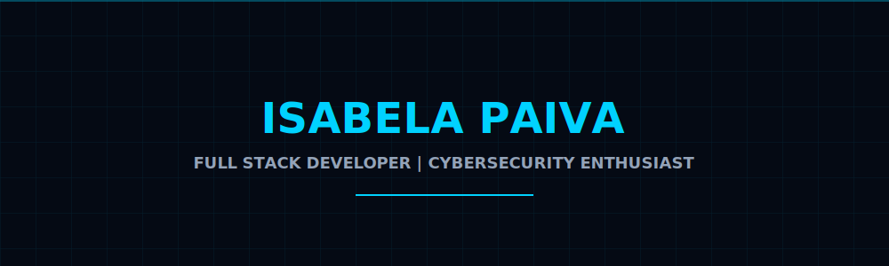

# 
Olá, eu sou a Isabela Paiva! 👋

  
  
   
  
  

---

### 🚀 Sobre mim | About Me

<table align="center">
  <tr>
    <td width="50%" valign="top">
      <strong>PT-BR:</strong> 
      Sou uma entusiasta da tecnologia e Full Stack Developer apaixonada por transformar ideias em soluções práticas. Com experiência em HTML, CSS, JavaScript, Python e SQL, busco unir curiosidade e propósito para gerar impacto positivo. Além do código, atuo como monitora acadêmica e participo de iniciativas de desenvolvimento sustentável.
    </td>
    <td width="50%" valign="top">
      <strong>EN:</strong> 
      I am a technology enthusiast and Full Stack Developer passionate about turning ideas into practical solutions. With experience in HTML, CSS, JavaScript, Python, and SQL, I combine curiosity and purpose to create positive impact. Beyond coding, I serve as an academic mentor and participate in sustainable development initiatives.
    </td>
  </tr>
</table>

---

### 💻 Minhas Tecnologias | Tech Stack

  
  **Languages & Fundamentals**  
  
  
  
  
  
  
   
  
  **Tools & Environments**  
  
  
  
  

---

### 🌟 Experiência & Valores | Experience & Values

- 🛠 **Full Stack Development**: Foco em integração front-end/back-end e soluções escaláveis.
- 🤝 **Liderança Colaborativa**: Experiência como monitora, facilitando o aprendizado e comunicação.
- 🌱 **Impacto Social**: Engajada em projetos de tecnologia para desenvolvimento sustentável.
- 📈 **Mindset de Crescimento**: Aprendizado contínuo e busca por excelência técnica.

---

### 📫 Vamos Conversar? | Let's Connect

  
  &nbsp;&nbsp;
  

 

  

 

  Feito com ❤️ por Isabela Paiva

